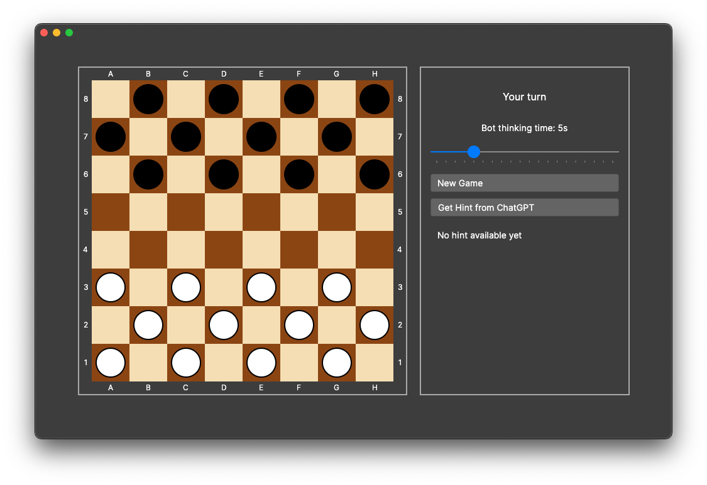
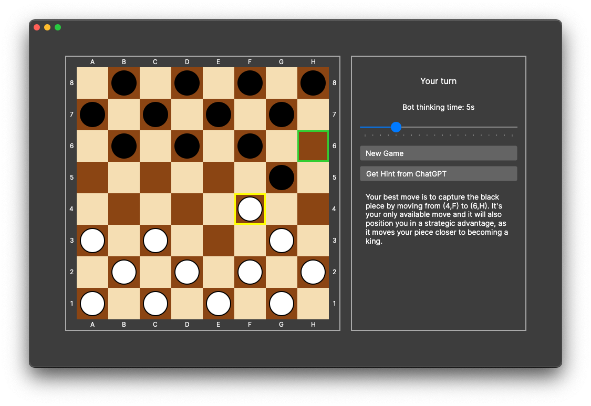

# Checkers Game

A feature-rich Checkers implementation with AI opponent and ChatGPT-powered hints.

## Features

- Full implementation of American checkers (8x8 board)
- Intuitive drag-and-drop interface with highlighted legal moves
- AI opponent with configurable thinking time
- Piece promotion to kings
- Multiple capture sequences
- ChatGPT integration for gameplay hints
- Game state tracking and display

## Technologies

- C# programming language
- Avalonia UI framework for cross-platform GUI
- Alpha-beta pruning AI algorithm
- OpenAI API integration

## Setup

### Prerequisites

- .NET 7.0 or higher
- OpenAI API key (for hint functionality)

### Installation

1. Clone the repository:
   ```
   git clone https://github.com/your-username/checkers.git
   cd checkers
   ```

2. Set your OpenAI API key:
   ```
   export OPENAI_API_KEY="your-api-key-here"
   ```
   Or edit the code to use your key directly in `MainWindow.cs`.

3. Build and run the application:
   ```
   dotnet build
   dotnet run
   ```

## How to Play

1. **Start**: The player (white) moves first.
2. **Movement**:
    - Click on a piece to select it
    - Valid moves will be highlighted in green
    - Click on a highlighted square to move

3. **Captures**:
    - Capturing opponent pieces is mandatory when available
    - Multiple captures in sequence are allowed

4. **Kings**:
    - Pieces that reach the opponent's back row become kings
    - Kings can move forward and backward

5. **Hints**: Click the "Get Hint from ChatGPT" button for strategic advice.

6. **Bot Difficulty**: Adjust the thinking time slider to make the AI stronger or weaker.

## Project Structure

The application follows the MVVM (Model-View-ViewModel) architecture:

- **Models**: Core game logic
    - `Board.cs`: Represents the game state using bitboards
    - `Move.cs`: Represents a single move
    - `Bot.cs`: AI implementation using alpha-beta search

- **ViewModels**:
    - `GameViewModel.cs`: Manages game state and logic, coordinates between view and model

- **Views**:
    - `MainWindow.axaml/cs`: UI components and interaction handling

## Implementation Details

### Board Representation

The game uses bitboards for efficient state representation and move generation:
- Three 64-bit integers track piece positions (`White`, `Black`, and `Kings`)
- This allows for fast move generation and board evaluation

### AI Implementation

The bot uses:
- Alpha-beta pruning algorithm for efficient search
- Iterative deepening to optimize thinking time
- Sophisticated board evaluation function considering:
    - Material advantage
    - King value
    - Piece advancement
    - Center control
    - Edge avoidance

### ChatGPT Integration

The hint system connects to OpenAI's GPT API to provide strategic advice:
- Current board state is converted to text representation
- Available moves are enumerated
- ChatGPT analyzes the position and suggests the best move

## License

[MIT License](LICENSE)

## Acknowledgments

- OpenAI for the ChatGPT API
- Avalonia UI for the cross-platform framework
